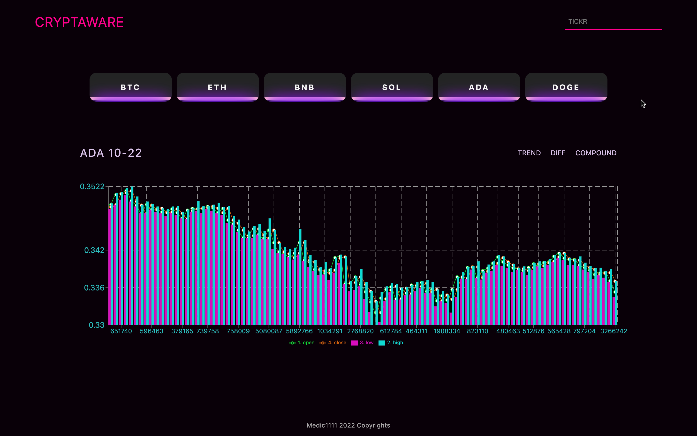
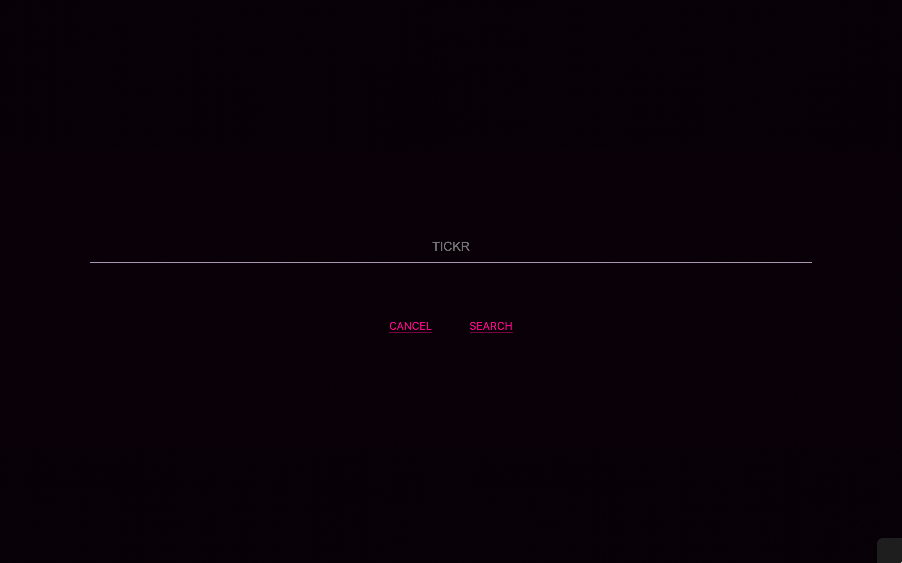

# CRYPTAWARE-V-Client_Only-TYPESCRYPT (in dev)

---

[Dev is live here](https://cryptaware-typescript.netlify.app/)

---

Client version of a crypto-currency tracker build with React. User may search and (currently) find the intraday data for crypto-currency of choice, with top currencies being available automatically.

> Full-stack in the making with MERN stack.

## QuickGuide

- [Tech](#tech)
- [Run with it](#run-with-it)
- [Upcoming](#tech)
- [Developer](#developer)

### TECH

- Client
  - React.js
    - useContext
    - Recharts
    - AlphaVantage API
- Deploy
  - Netlify

---

### RUN WITH IT

1. Fork Repo
2. Run `npm install` to install all dependencies
3. Get an api key at [alphavantage](https://www.alphavantage.co/)
4. Create a `.env` file and add your api key with as: `REACT_APP_API_KEY="your_key_here_between_quotes"`
5. Run `npm start` and on `http://localhost:3000/` the app will be running

---

### UPCOMING: work in progress

> FEATURES (CLIENT ONLY)

- [ ] select or choose month/week/day options

> FEATURES-incomplete-Ideas for (MERN)

- [ ] Auth-Encryption-Token
- [ ] CRUD Tracking records for tickers
- [ ] Provide list of available tickers
- [ ] News or related info to spec ticker based on selection
- [ ] CHALLENGES: Figure out how to work around API call's limit and evaluate if the ideas above are feasable based on it.

---

### DEVELOPER

**:point_right: Aryse Tansy**
:e-mail: paganowebdev@gmail.com
:computer: [Portfolio](https://www.pagano.dev/)

---
